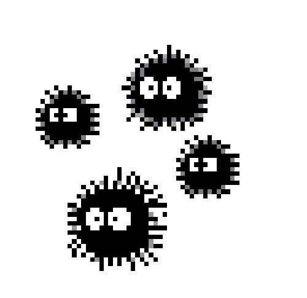

  <h2 align="center">Hello there! </h2>
<h4 align="center"> My name is Paco and I'm a student at <a href="https://42nice.fr/">42 Nice</a>. </h4>

I have experience working with programming languages and technologies such as <i>C, C++, Python, HTML, CSS, Git and more</i> making me ready to tackle challenges that come my way.

I'm a hard-working and dedicated team player, always looking for opportunities to learn and grow. So, if you're interested in working together, please feel free to reach out to me. Let's create something <b>awesome</b> together!

  
  

  

  

  

  

  

  

  

  

    
  

 

  

  
  

